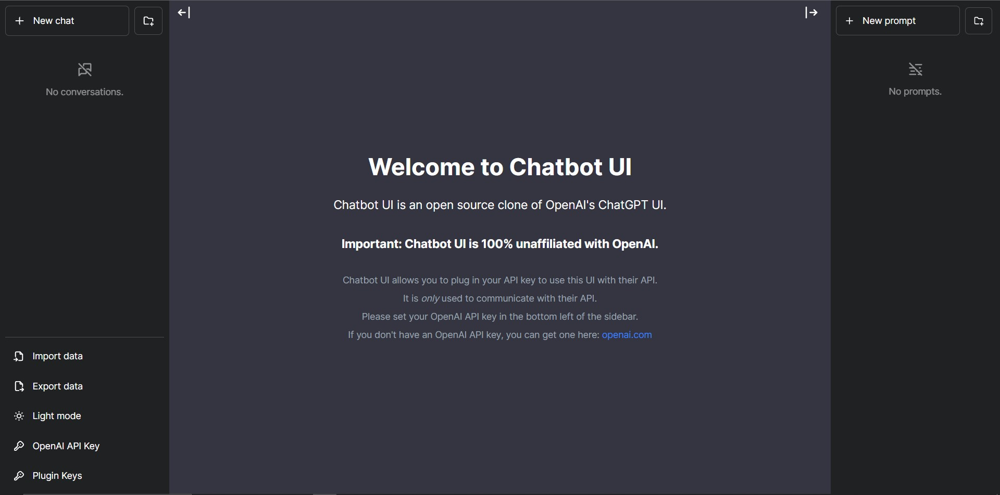

# Chatbot UI

# Changes

a new api to get okta access token to use has auth header for to send to server

`pages/api/External/Token`
use this to in future to get access tokens before any request to the server
also to access this api a user first must be logged in
```ts
import { getAccessToken, withApiAuthRequired } from '@auth0/nextjs-auth0';
import { NextApiRequest } from 'next';
import { NextResponse } from 'next/server';

 const GET=withApiAuthRequired(async function handler(req: NextApiRequest, res: any) {
  try {
    const { accessToken } = await getAccessToken(req, res, {
      scopes: ['read:folder','write:folder','update:folder'] //Creat your own apis access's
    });
      return res.status(200).send({accessToken:accessToken});
  } catch (error: any) {
    console.error('Error fetching access Token:', error);
    return  NextResponse.json({ error: error.message }, { status: error.status || 500 });
  }
});

export default GET;
```
use `utils/app/fetchToken.ts`
to access the api to get access token

# Api's
[create an API](https://auth0.com/docs/authorization/apis) using the [management dashboard](https://manage.auth0.com/#/apis). This will give you an API Identifier that you can use in the `AUTH0_AUDIENCE` environment variable below. Then you will need to [add a permission](https://auth0.com/docs/get-started/dashboard/add-api-permissions) named `read:folder update:folder write:folder` to your API. To get your app to ask for that permission, include it in the value of the `AUTH0_SCOPE` environment variable.

## News

Chatbot UI 2.0 is out as an updated, hosted product!

Check out [Takeoff Chat](https://www.takeoffchat.com/).

Open source version coming soon!

## About

Chatbot UI is an open source chat UI for AI models.

See a [demo](https://twitter.com/mckaywrigley/status/1640380021423603713?s=46&t=AowqkodyK6B4JccSOxSPew).



## Updates

Chatbot UI will be updated over time.

Expect frequent improvements.

**Next up:**

- [ ] Sharing
- [ ] "Bots"

## Deploy

**Vercel**

Host your own live version of Chatbot UI with Vercel.

[](https://vercel.com/new/clone?repository-url=https%3A%2F%2Fgithub.com%2Fmckaywrigley%2Fchatbot-ui)

**Docker**

Build locally:

```shell
docker build -t chatgpt-ui .
docker run -e OPENAI_API_KEY=xxxxxxxx -p 3000:3000 chatgpt-ui
```

Pull from ghcr:

```
docker run -e OPENAI_API_KEY=xxxxxxxx -p 3000:3000 ghcr.io/mckaywrigley/chatbot-ui:main
```

## Running Locally

**1. Clone Repo**

```bash
git clone https://github.com/mckaywrigley/chatbot-ui.git
```

**2. Install Dependencies**

```bash
npm i
```

**3. Provide OpenAI API Key**

Create a .env.local file in the root of the repo with your OpenAI API Key:

```bash
OPENAI_API_KEY=YOUR_KEY
#OKTA
AUTH0_SECRET=
AUTH0_BASE_URL=
AUTH0_ISSUER_BASE_URL=
AUTH0_CLIENT_ID=
AUTH0_CLIENT_SECRET=
AUTH0_AUDIENCE=
AUTH0_SCOPE='openid profile read:folder write:folder update:folder'
NEXT_PUBLIC_SERVER_LINk=http://localhost:5000

```

> You can set `OPENAI_API_HOST` where access to the official OpenAI host is restricted or unavailable, allowing users to configure an alternative host for their specific needs.

> Additionally, if you have multiple OpenAI Organizations, you can set `OPENAI_ORGANIZATION` to specify one.

**4. Run App**

```bash
npm run dev
```

**5. Use It**

You should be able to start chatting.

## Configuration

When deploying the application, the following environment variables can be set:

| Environment Variable              | Default value                  | Description                                                                                                                               |
| --------------------------------- | ------------------------------ | ----------------------------------------------------------------------------------------------------------------------------------------- |
| OPENAI_API_KEY                    |                                | The default API key used for authentication with OpenAI                                                                                   |
| OPENAI_API_HOST                   | `https://api.openai.com`       | The base url, for Azure use `https://<endpoint>.openai.azure.com`                                                                         |
| OPENAI_API_TYPE                   | `openai`                       | The API type, options are `openai` or `azure`                                                                                             |
| OPENAI_API_VERSION                | `2023-03-15-preview`           | Only applicable for Azure OpenAI                                                                                                          |
| AZURE_DEPLOYMENT_ID               |                                | Needed when Azure OpenAI, Ref [Azure OpenAI API](https://learn.microsoft.com/zh-cn/azure/cognitive-services/openai/reference#completions) |
| OPENAI_ORGANIZATION               |                                | Your OpenAI organization ID                                                                                                               |
| DEFAULT_MODEL                     | `gpt-3.5-turbo`                | The default model to use on new conversations, for Azure use `gpt-35-turbo`                                                               |
| NEXT_PUBLIC_DEFAULT_SYSTEM_PROMPT | [see here](utils/app/const.ts) | The default system prompt to use on new conversations                                                                                     |
| NEXT_PUBLIC_DEFAULT_TEMPERATURE   | 1                              | The default temperature to use on new conversations                                                                                       |
| GOOGLE_API_KEY                    |                                | See [Custom Search JSON API documentation][GCSE]                                                                                          |
| GOOGLE_CSE_ID                     |                                | See [Custom Search JSON API documentation][GCSE]                                                                                          |

If you do not provide an OpenAI API key with `OPENAI_API_KEY`, users will have to provide their own key.

If you don't have an OpenAI API key, you can get one [here](https://platform.openai.com/account/api-keys).

## Contact

If you have any questions, feel free to reach out to Mckay on [Twitter](https://twitter.com/mckaywrigley).

[GCSE]: https://developers.google.com/custom-search/v1/overview
